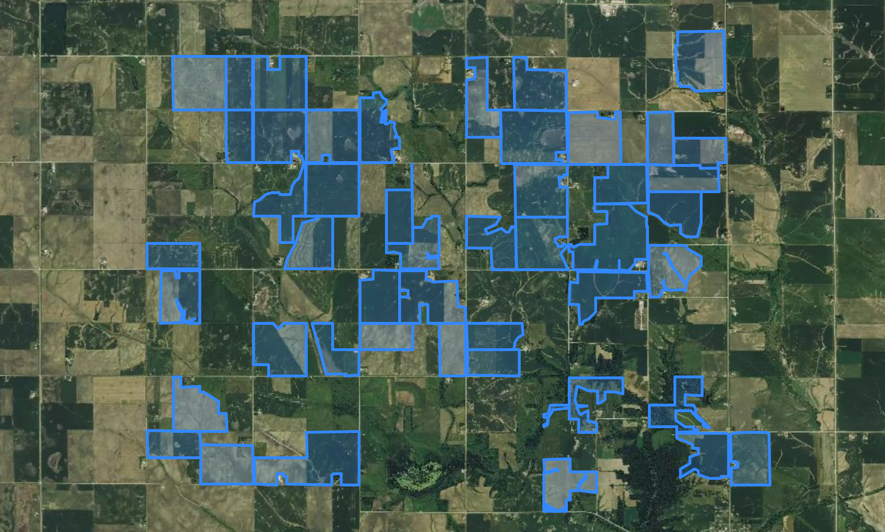

# Basic Astro Digital NDVI Vector Map Setup

###[Working Example](https://rawgit.com/AstroDigital/example-ndvi-vector/master/example/index.html) | [Primary Code](https://github.com/AstroDigital/example-ndvi-vector/blob/master/example/ad-basic-map.js)

[](https://rawgit.com/AstroDigital/example-ndvi-vector/master/example/index.html)

## Overview
This tutorial describes taking vector data from the return of [Astro Digital's NDVI values API](https://docs.astrodigital.com/docs/results), and rendering it as a map using the Leaflet Javascript framework.

Try setting up this example first, then move on to other tutorials in this series:
- [Symbolizing the NDVI vector product map](https://github.com/AstroDigital/example-ndvi-vector-symbology)
- [Using the vector and imagery NDVI products to create masked imagery](https://github.com/AstroDigital/example-field-mask) and
- [Graphing the NDVI values using Chart.js, and including precipitation as a secondary datasource](https://github.com/AstroDigital/example-ndvi-chart-plus).

## Summary

The [Astro Digital NDVI values response](https://docs.astrodigital.com/docs/results) includes a `results` attribute, which is an array in which each feature represents an input polygon containing two attributes that we will most likely need to create a map: a numerical `id` and a `value`. The value consists of GeoJSON describing the geometry of the feature, and properties describing its NDVI values over time.

To create a FeatureCollection from this data, map over the `results` attribute and extract the `id` and `values` for each feature. Insert the output array into simple GeoJSON `FeatureCollection` boilerplate, then convert the entire GeoJSON object to a Leaflet layer, as shown below:
```js
let fieldPolys = L.geoJson({
  'type': 'FeatureCollection',
  'features': adNdviData.results.map((field) => {
    const id = field.id;
    field = field.value;
    field.properties.id = id;
    return field;
  })
});
```
Once the layer has been created, it can easily be mapped using Leaflet. In order to take advantage of the satellite imagery basemap we will use in this example, you will need to create a free Mapbox account and obtain a public key at [this address](https://www.mapbox.com/studio/account/tokens).

The `setupMap` function in this example initializes a Leaflet map inside of the div called `#map`, adds a satellite imagery basemap provided by Mapbox, adds the Astro Digital vector data with default styling, and sets the map view to the footprint of the vector data:
```js
const setupMap = (fieldPolys, mbAccessToken) => {
  const basemapUrl = 'http://api.tiles.mapbox.com/v4/mapbox.satellite/{z}/{x}/{y}.png';
  const map = L.map('map').setView([0, 0], 0);
  L.tileLayer(`${basemapUrl}?access_token=${mbAccessToken}`).addTo(map);
  // Add the field polygons to the map.
  fieldPolys.addTo(map);
  // Set the map view to the field polygon boundaries.
  map.fitBounds(fieldPolys.getBounds());
}
```

Check out [the source code for more details!](example/ad-basic-map.js)

## Up Next
This basic map is just the start of what we can do with the Astro Digital NDVI product. Mapbox provides many excellent and inspirational mapping examples on [their site](https://www.mapbox.com/mapbox.js/example/v1.0.0/) using their forked version of Leaflet, and [up next](https://github.com/AstroDigital/example-ndvi-vector-symbology) we will cover adding a legend to this initial map in order to visualize NDVI intensity.
